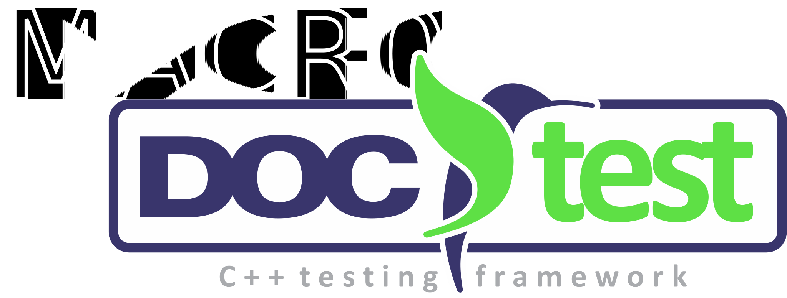

# MACROdoctest

[![Release][release-image]][releases] [![License][license-image]][license] 

[release-image]: https://img.shields.io/badge/release-1.0-green.svg?style=flat
[releases]: https://github.com/loumalouomega/MACROdoctest/releases

[license-image]: https://img.shields.io/badge/license-MIT-blue.svg?style=flat
[license]: https://github.com/loumalouomega/MACROdoctest/blob/main/LICENSE

A set of macros that help to create simple tests using [doctest](https://github.com/onqtam/doctest).

## Installation

### Download

Download this repository with:

~~~sh
git https://github.com/loumalouomega/MACROdoctest.git
~~~

### Building

In order to to use compile the library and be able to use it inside your project, copy the files (or generate a *git* submodule) in a folder below the root folder of the project and add the following to your *CMakeLists.txt*:

~~~cmake
# Include the doctest library
ADD_SUBDIRECTORY( *MACROdoctest_src_folder* )
~~~

Therefore, in the *CMakeLists.txt* where your unnitests are defined:

~~~cmake
# Retrieving doctest library
GET_PROPERTY(DOCTEST_INCLUDE_DIR GLOBAL PROPERTY GLOBAL_DOCTEST_INCLUDE_DIR)
GET_PROPERTY(DOCTEST_LIBRARIES GLOBAL PROPERTY GLOBAL_DOCTEST_LIBRARIES)
~~~

Then these include and libraries must be considered in the test binary definition:

~~~cmake
# Compile the test
ADD_EXECUTABLE(TestBinaryName "${CPP_TEST_FILES}")
TARGET_INCLUDE_DIRECTORIES(TestBinaryName PUBLIC ${DOCTEST_INCLUDE_DIR} ${OTHER_INCLUDES})
TARGET_LINK_LIBRARIES(TestBinaryName PRIVATE ${DOCTEST_LIBRARIES} ${OTHER_LIBRARIES})
~~~

You can see the *test* folder of this repository as a template of how to properly use it.

## Usage

In order to define an unnitest with the library you need to do the corresponding include:

~~~c++
#include "doctest_checks.h"
~~~

Then the definition of the tests suites and tests cases follow the [doctest](https://github.com/onqtam/doctest) standard:

~~~c++
TEST_SUITE("MyTestSuite")
{
    TEST_CASE("TestCase")
    {
        const bool value = true;
        DOCTEST_CHECK_IS_TRUE(value);
    }
...
}

ADD_DOCTEST_TEST
~~~

The macros predefined in `doctest_checks.h`are:

- `DOCTEST_CHECK_IS_TRUE`: Checks if the returning value is true.
- `DOCTEST_CHECK_IS_FALSE`: Checks if the returning value is false.
- `DOCTEST_CHECK_EQUAL`: Checks if the two values are equal.
- `DOCTEST_CHECK_NOT_EQUAL`: Checks if the two values are not equal.
- `DOCTEST_CHECK_STRING_EQUAL`: Checks if the two strings are equal.
- `DOCTEST_CHECK_STRING_NOT_EQUAL`: Checks if the two strings are not equal.
- `DOCTEST_CHECK_C_STRING_EQUAL`: Checks if the two C strings are equal.
- `DOCTEST_CHECK_C_STRING_NOT_EQUAL`: Checks if the two C strings are not equal.
- `DOCTEST_CHECK_STRING_CONTAIN_SUB_STRING`: Checks if the first string constains a substring of the second one.
- `DOCTEST_CHECK_LESS`: Checks if the first value is lesser than the second one.
- `DOCTEST_CHECK_LESS_EQUAL`: Checks if the first value is lesser or equal than the second one.
- `DOCTEST_CHECK_GREATER`: Checks if the first value is greater than the second one.
- `DOCTEST_CHECK_GREATER_EQUAL`: Checks if the first value is greater or equal than the second one.
- `DOCTEST_CHECK_NEAR`: Checks if the two values are near by a certain tolerance.
- `DOCTEST_CHECK_RELATIVE_NEAR`: Checks if the two values are relatively near by a certain tolerance.
- `DOCTEST_CHECK_DOUBLE_EQUAL`: Checks if the two values are near by a numerical precission tolerance.
- `DOCTEST_CHECK_VECTOR_NEAR`: Checks if the two vectors are near by a certain tolerance.
- `DOCTEST_CHECK_VECTOR_RELATIVE_NEAR`: Checks if the two vectors are relatively near by a certain tolerance.
- `DOCTEST_CHECK_VECTOR_EQUAL`: Checks if the two vectors are near by a numerical precission tolerance.
- `DOCTEST_CHECK_MATRIX_NEAR`: Checks if the two matrices are near by a certain tolerance.
- `DOCTEST_CHECK_MATRIX_RELATIVE_NEAR`: Checks if the two matrices are relatively near by a certain tolerance.
- `DOCTEST_CHECK_MATRIX_EQUAL`: Checks if the two matrices are near by a numerical precission tolerance.

**Do not forget to add the corresponding macro at the end of the test file in order to generate the executable:**

~~~c++
...
    }
}

ADD_DOCTEST_TEST
~~~
